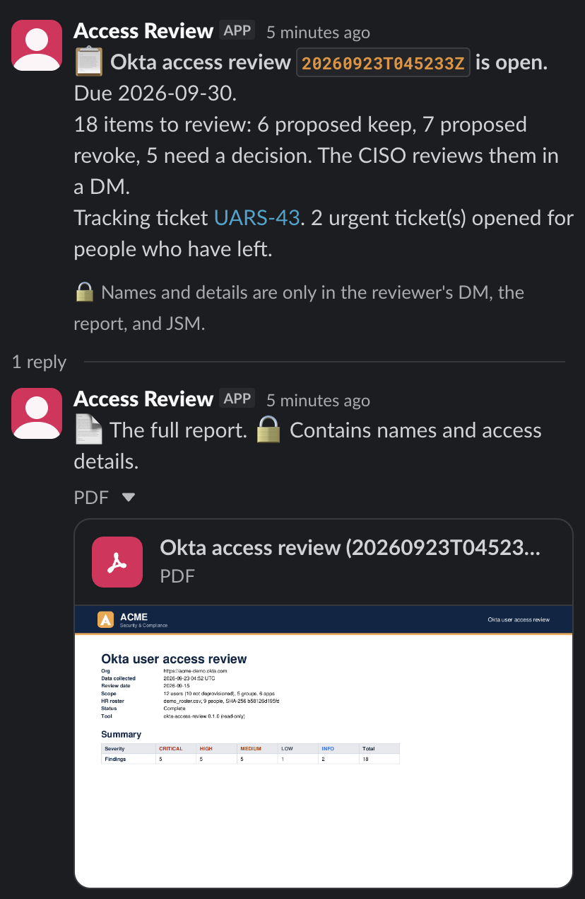
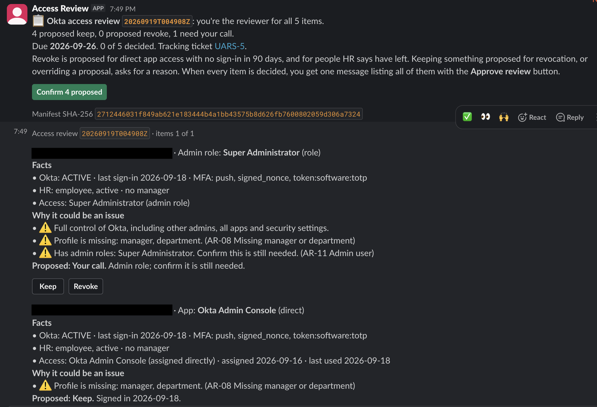
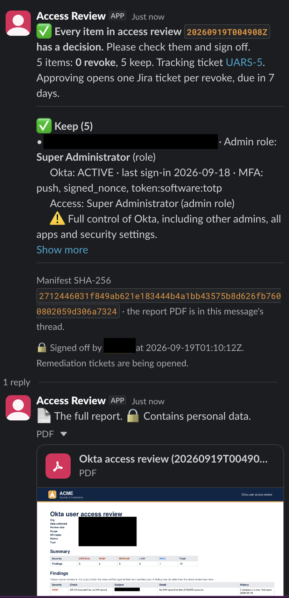
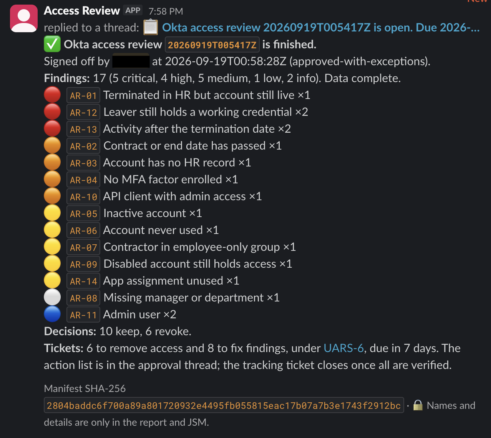
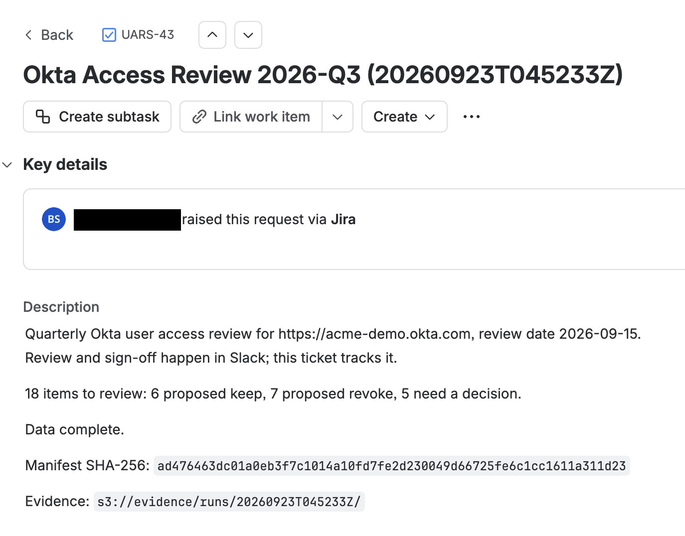
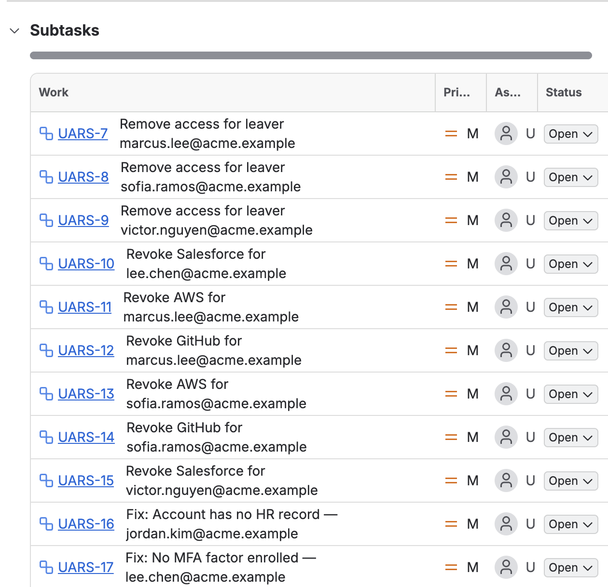
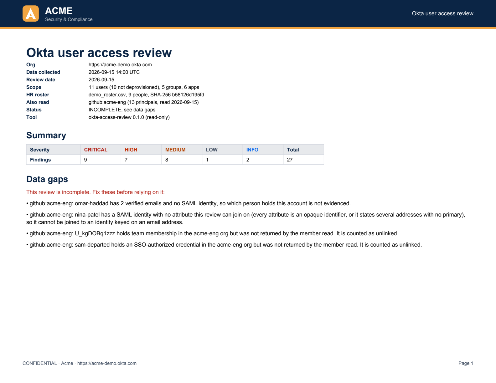
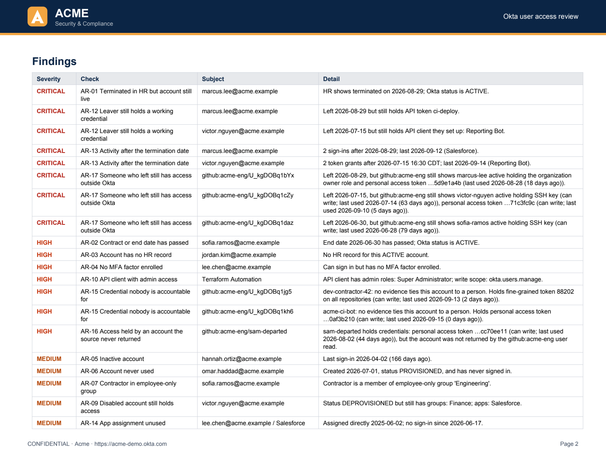
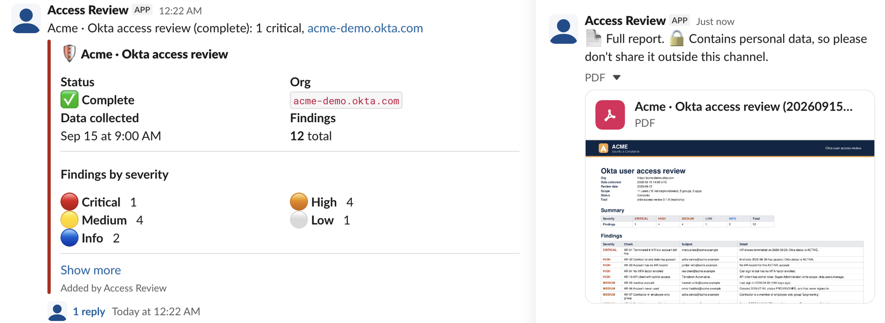

# okta-access-review-aws

A quarterly user access review that runs in AWS, is approved in Slack, and tracks fixes as Jira
Service Management tickets. It compares Okta users, groups, apps, MFA enrollment and admin roles
with an HR roster, and joins the accounts and credentials people hold in other systems onto the same
people — so a departure can be checked against the long tail an Okta deactivation never reaches.
Access is flagged to remove or confirm, and the results are saved as evidence for SOC 2 (CC6.1–CC6.3)
and ISO 27001:2022 (A.5.15–A.8.5). Every source is only ever read.

- **In AWS** ([docs/aws.md](docs/aws.md)): a scheduled Step Functions workflow collects the review
  and asks the CISO to decide each item in Slack, showing the facts, why it could be an issue, and
  a proposed decision. After sign-off it opens a JSM ticket for each piece of access to remove and
  each finding to fix, under one tracking ticket per quarter, and posts an action checklist. A daily
  check re-reads Okta to confirm each resolved ticket really changed it and ticks it off; a ticket
  Okta can't settle — a fix somewhere else — is taken on the reviewer's word and says so, and the
  tracking ticket closes once every ticket is settled one of those two ways. Built with Terraform,
  and removed with one script ([docs/teardown.md](docs/teardown.md)). Running a review, step by
  step: [docs/runbook.md](docs/runbook.md).
- **Or locally**, as the original command-line tool: the same checks and report, run on a laptop.

Seeded from `okta-access-review` at commit 1a20697. The local tool below works the same way.

- 18 checks. Fourteen read Okta: leavers who still hold a working API credential, terminated users
  with live accounts, missing MFA, app assignments nobody uses, API clients with write access. Four
  read [across sources](#across-sources): credentials nobody is accountable for, access held by an
  account no user read returned, and what a departure leaves behind in another system.
- Read-only scopes, Private Key JWT, and DPoP-bound tokens.
- Output: a PDF with a sign-off page, CSVs, the raw data, and a manifest of SHA-256 hashes.
- Shows how many reviews in a row each finding has been open, from earlier report folders it has
  verified, and `access-review attest` records a sign-off tied to the report's manifest.
- The report is marked incomplete if a source withholds data, and names the source. A read that
  failed is reported as incomplete, never as nothing found.
- Optionally emails the PDF and posts a summary to Slack. Messages contain no personal data.

## Built with

| | Used for |
|---|---|
| **Okta** | The system being reviewed, read through its API with read-only scopes |
| **GitHub** | The optional second source: org membership and roles, SAML identities, PATs and SSH keys. Read from a snapshot file passed with `--github`; there's no collector for it yet |
| **Slack** | The review and sign-off: a bot posts to one channel and DMs the reviewer (the CISO), who decides with buttons |
| **Jira Service Management** | A tracking ticket per review, and a ticket for each piece of access to remove and each finding to fix |
| **AWS Lambda** | All of the compute and automation: collecting from Okta, posting to Slack, handling button clicks, opening tickets, reminders, and the daily check. Eight functions share one container image (Python, arm64). |
| **AWS Step Functions** | Runs the steps of a review in order and waits for the sign-off |
| **Amazon EventBridge Scheduler** | Starts the quarterly review and the hourly and daily jobs |
| **Amazon S3** | The evidence, kept create-only under Object Lock, and the review's working state |
| **AWS Systems Manager Parameter Store** | The four secrets: the Okta key, the Slack token and signing secret, and the Jira token |
| **Amazon ECR, IAM, CloudWatch Logs, AWS Budgets** | The container image, one least-privilege role per function, 30-day logs, and a cost alert |
| **Terraform** | **All of the AWS infrastructure.** A one-time bootstrap creates the state bucket and the CI roles; everything else is `infra/main`. The only AWS step done by hand is storing the four secret values, which Terraform deliberately never holds. |
| **GitHub Actions** | Tests, security checks and Terraform on every pull request; on `master`, builds the image and applies Terraform after an approval. It signs in to AWS through OIDC, so there are no stored AWS keys. |

## How a review looks

Screenshots from a real run against a development Okta org, and from a demo run with the fictional
**Acme** company (`scripts/demo_to_slack.py`). Real names, emails and the org URL are blacked out.

**1. The review opens.** The review channel gets counts only and a link to the tracking ticket, with
the full report PDF in the thread.



**2. The CISO decides each item** in a DM. Each card shows the facts, anything the person holds in
another source that this decision cannot change, then why it could be an issue, then the proposal and
the buttons. **Confirm N proposed** accepts every proposal at once.



**3. The CISO signs off.** Once every item is decided, one message lists every decision with its facts
and concerns, bound to the report's SHA-256, with **Approve review** below.



**4. The review finishes.** Tickets are opened and the channel thread gets a summary: who signed off,
findings by check, the decisions, and where the tickets are.



<details>
<summary>The tickets in Jira Service Management</summary>

One tracking ticket per review, with the manifest hash and where the evidence is:



Under it, one sub-ticket for each leaver, each revoke and each finding to fix. Each links to the
person in the Okta admin console. The tracking ticket closes itself once every ticket is resolved
and, where Okta can show the change, verified by the daily check.



</details>

## Sample report

Every run produces a PDF like this. All data is from **Acme**, a fictional company.



<details>
<summary>Page 2: remediation, control mapping and access by user</summary>



</details>

[Full sample PDF](docs/sample-report.pdf) · The same run posted to Slack:



## Try it without Okta

```bash
uv run access-review \
  --snapshot fixtures/demo_snapshot.json \
  --roster fixtures/demo_roster.csv \
  --config fixtures/demo_config.json \
  --github fixtures/demo_github.json \
  --as-of 2026-09-15
```

The demo org has exactly one planted issue for each check, and the tests confirm the review finds
those and nothing else. `--github` supplies the second estate: leave it out and the run is a valid
Okta-only review, with the planted cases that live in the GitHub fixture absent from it.

## Checks

| ID | Finds | Severity | Controls |
|---|---|---|---|
| AR-01 | Terminated in HR, but the account is still live | critical | SOC 2 CC6.2, CC6.3 · ISO A.5.18 |
| AR-02 | Contract or end date has passed | high | SOC 2 CC6.2 · ISO A.5.18 |
| AR-03 | Account with no HR record (service accounts can be listed); acknowledged by the CISO and raised with HR, no ticket | high | SOC 2 CC6.2 · ISO A.5.16 |
| AR-04 | Can sign in, but has no MFA factor | high | SOC 2 CC6.1 · ISO A.8.5 |
| AR-05 | No sign-in for 90+ days | medium | SOC 2 CC6.2 · ISO A.5.18 |
| AR-06 | Created 14+ days ago and never used | medium | SOC 2 CC6.2 · ISO A.5.16 |
| AR-07 | Contractor in an employee-only group | medium | SOC 2 CC6.3 · ISO A.5.15 |
| AR-08 | Missing manager or department | low | SOC 2 CC6.2 · ISO A.5.16 |
| AR-09 | Suspended or deprovisioned, but still in groups or apps (unless it is a service account AR-18 has) | medium | SOC 2 CC6.2 · ISO A.5.18 |
| AR-10 | Service app with write scopes or an admin role that can make changes (high if Super Administrator) | medium | SOC 2 CC6.3 · ISO A.8.2 |
| AR-11 | Admin user, for the reviewer to confirm | info | SOC 2 CC6.3 · ISO A.8.2 |
| AR-12 | Leaver still holds a working API token | critical | SOC 2 CC6.2, CC6.3 · ISO A.5.18 |
| AR-13 | Signed in, or used a credential, after their last working day | critical | SOC 2 CC6.2, CC7.2 · ISO A.5.18, A.8.16 |
| AR-14 | Directly assigned app with no sign-in to it for 90+ days (skipped if the System Log can't be read in full) | medium | SOC 2 CC6.2 · ISO A.5.18 |
| AR-15 | A credential no evidence ties to a person, or one the register declares and names no owner for (a rung milder); high if it can write and may be in use | medium | SOC 2 CC6.1, CC6.2 · ISO A.5.16, A.5.18 |
| AR-16 | Something holds access that the source's own user or member read never returned | high | SOC 2 CC6.1, CC6.2, CC6.3 · ISO A.5.16, A.5.18 |
| AR-17 | Someone who left still has access in a system Okta deactivation doesn't reach | critical | SOC 2 CC6.2, CC6.3 · ISO A.5.16, A.5.18, A.8.2 |
| AR-18 | Service account a leaver owned, or held the secret of (critical if it can change anything, or if that is unknown) | high | SOC 2 CC6.1, CC6.2, CC6.3 · ISO A.5.16, A.5.17, A.5.18, A.8.2 |

AR-01 to AR-03, AR-12, AR-13, AR-17 and AR-18 compare what the review found with an HR roster: a CSV
exported from the HR system and passed in with `--roster` (there's no live HR integration yet).
Without it they're skipped, and the report says so. Thresholds and group names are configurable.

AR-12, AR-13 and AR-18 are about the leaver cases an account status doesn't show. An Okta API token keeps
working after the account is deactivated: that is AR-12, and the daily check sees the revocation
in Okta. A copy of an API client secret the leaver created, added or read also keeps working. That is AR-18's,
together with any client they owned: somebody still here has to answer for it, and every secret they
held has to be rotated. A reviewer confirms the rotation, because Okta can't show it reliably (a key
published at a `jwks_uri` never appears there). Only the System Log records who created a client, so
ownership comes from creation events alone: reading a colleague's secret makes someone its custodian,
not its owner. AR-13 reads the System Log to say
whether the leaver's own account was used after their last working day. A client going on running
after they leave is what it is for, not their activity. Okta keeps 90 days of log data, so a
termination older than that is reported as a gap rather than as nothing to see.

AR-09 stands down the same way for a declared bot account that is deactivated and still holds groups
and apps: AR-18 takes the account, names its state and lists the groups and apps reactivating it
would restore, so the reviewer sees the blast radius while deciding between handover and decommission. Every check declares whether its
remediation removes the account's access, keeps the account running, or neither, and a test asserts
that no account is the subject of both a removal and a keep.

## Across sources

AR-15 to AR-18 don't read the Okta snapshot. They read an identity graph: the principals that can
hold access in each source, the credentials that keep working after the account they were created
under is deactivated, the grants each principal holds, and the links saying which principal belongs
to which person. Each source is projected into it — Okta from its snapshot, GitHub from its own —
and the graph is what these four checks reason over. Three rules shape it.

**A link is evidenced or it is absent.** A principal is tied to a person by the IdP's own SSO
assertion, an email the source itself states as verified, a register entry somebody signed up to, or
an audit log's record of who created the account. Never by name or email similarity. The methods are
a ladder rather than a score, and two equally strong links naming different people leave the account
unlinked, which is itself a finding. A false link is worse than no link: it marks a credential as
accounted for when nobody is accountable for it.

**Completeness is tracked per source.** A read that failed is recorded against that source, so the
review never reports "no GitHub credentials" when the GitHub call simply failed. Emptiness is
evidence only when the read that would have said so actually ran: an unread scope list is unknown
write access rather than read-only, and an account with no credentials found under a failed read is
still reported. Unknown is never ranked as the milder case.

**The service account register is an ownership claim, not a mute button.** `config.service_accounts`
records which accounts are not people and who owns each. An entry with an owner ties the account to
that person, so it appears in their access review and in their departure bundle if they leave. An
entry naming nobody — or naming somebody no source evidences — is still reported, one severity
milder: it declares the account without making anyone accountable for it. Details:
[docs/configuration.md](docs/configuration.md#the-service-account-register).

All four run on an Okta-only estate too, where AR-18 finds an API client a leaver owned or held the
secret of. What a second source adds is the other estate — the org roles, PATs and SSH keys a
departure leaves behind — and a per-departure bundle in `transitions.json`.

## Evidence produced

Each run writes a folder named after its collection time:

| File | For |
|---|---|
| `report.pdf` / `report.md` | Findings with fixes and control mapping, access by user, reviewer sign-off |
| `access_matrix.csv` | Every user's access, with blank `decision` and `reviewer` columns to fill in |
| `findings.csv` | Tracking remediation, with how long each finding has been open |
| `snapshot.json` | The exact Okta data the checks ran on |
| `github_snapshot.json` | The GitHub data, when `--github` was given: the cross-source findings rest on it |
| `transitions.json` | One bundle per departure (with `--github`): everything that person still holds across sources, the evidence linking each account to them, and every finding about them. A departure bundle needs a second estate to be worth writing, so an Okta-only run produces none |
| `roster.csv` | A copy of the HR roster export the review compared against |
| `manifest.json` | Config, roster name, row count and hash, completeness, the earlier reviews history was read from, and a SHA-256 hash of every file |
| `attestations.json` | Added by `access-review attest <folder> --decision approved --reviewer NAME`: sign-offs tied to the manifest's hash ([details](docs/configuration.md#sign-off-attest)) |

`--fail-on high` exits with status 2 when there's a high or critical finding, so a scheduled job or
CI pipeline can alert on it.

## Security design

The tool sees an identity provider with admin-level visibility and writes files full of personal
data. It assumes the laptop, repo or logs could leak, and limits what a leak is worth:

- **Read-only in three places:** Okta grants only `.read` scopes, the CLI refuses any other scope,
  and the client can only send GET requests (a test enforces it).
- **No shared secrets on disk:** Private Key JWT, with every secret fetched from 1Password at run
  time. A secret pasted into the wrong setting is rejected without being printed.
- **Stolen tokens are useless:** DPoP binds each access token to a key that exists only in memory
  for that run.
- **A tested admin-role tradeoff:** only Super Administrator can read admin role assignments. The
  app pairs it with read-only scopes and flags itself for review on every run.
- **Personal data stays in the report:** emails and Slack messages carry only counts, and uploading
  the PDF to Slack is opt-in. Credentials never appear in output or errors.
- **Pinned supply chain:** locked dependencies with a publish-date cutoff.

Details, including the admin-role test results: [docs/security.md](docs/security.md).

## Run it on your org

1. Create an Okta API Services app with read scopes and DPoP
   ([step-by-step](docs/configuration.md#okta-app)), and store its key in 1Password.
2. Run `cp env.example env`, fill it in, and run `git config core.hooksPath .githooks`.
3. Put your HR roster and config in `roster/` (git-ignored), then run:

   ```bash
   ./run.sh --roster roster/hr-roster.csv --config roster/config.json
   ```

Email and Slack are optional: see [docs/notifications.md](docs/notifications.md). All settings,
PDF branding and the roster format are in [docs/configuration.md](docs/configuration.md).

## Limitations

- There's no collector for the second source yet. GitHub data is a snapshot file passed with
  `--github`, and the AWS pipeline doesn't pass one, so its runs are Okta-only.
- MFA status comes from enrolled factors. It doesn't check whether a sign-on policy requires MFA.
- Admin roles granted through a group aren't expanded to the group's members yet.
- Apps assigned through several groups are listed once per group.

## Development

```bash
uv run pytest -q
uv run python scripts/render_samples.py   # after changing the PDF layout or demo data
uv run python scripts/e2e_local.py        # one whole review through the AWS workflow, all in memory
```

The tests cover every check, the Okta client (including DPoP), the PDF, email and Slack, the Slack
review and sign-off, JSM tickets, the S3 evidence store and teardown, and they fail if the sample
report in this README is out of date. None of them reach AWS, Slack or Jira.

### Compliance workflow

Every pull request and push to `master` runs the [Compliance workflow](docs/ci.md):

| Check | SOC 2 | ISO 27001 |
|---|---|---|
| Tests, including the demo review | CC8.1 | A.8.29 |
| Secret scan of the full git history (gitleaks) | CC6.1 | A.8.12 |
| Dependency vulnerabilities and lockfile (pip-audit) | CC7.1 | A.8.8 |
| Workflow security lint (zizmor) | CC8.1 | A.8.9 |
| Terraform format, validation, lint and security scan (tflint, checkov) | CC8.1 | A.8.9 |
| Branch protection on `master` | CC8.1 | A.8.32 |

The results are bundled as evidence with SHA-256 hashes. On `master`, the bundle is signed with a
GitHub artifact attestation. All actions are pinned to commit SHAs, and jobs run with minimal
permissions.

Related: [okta-mcp-local](https://github.com/matt-spellcaster/okta-mcp-local) connects an AI
assistant to Okta for interactive admin work, with the same credential handling.
